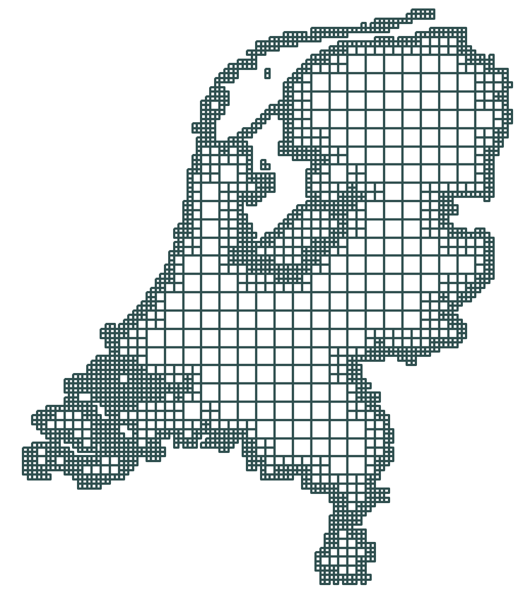

# nlmod

Python package with functions to process, build and visualise MODFLOW models in the Netherlands. 

The functions in nlmod have four main objectives:
1. Create and adapt the temporal and spatial discretization of a MODFLOW model using an xarray Dataset (`nlmod.dims`).
2. Download and read data from external sources, project this data on the modelgrid and add this data to an xarray Dataset (`nlmod.read`).
3. Use data in an xarray Dataset to build modflow packages using FloPy (`nlmod.gwf` for Modflow 6 and `nlmod.modpath` for Modpath).
4. Visualise modeldata in Python (`nlmod.plot`) or GIS software (`nlmod.gis`).

More information can be found on the documentation-website: https://nlmod.readthedocs.io/.

## Installation

Install the module with pip:

`pip install nlmod`

`nlmod` has many required dependencies: `flopy`, `xarray`, `netcdf4`, `rasterio`, `rioxarray`, `affine`, `geopandas`, `owslib`, `hydropandas`, `shapely`, `pyshp`, `rtree`, `matplotlib`, `dask` and `colorama`. On top of that there are some optional dependecies, only needed (and imported) in a single method: bottleneck (used in calculate_gxg) and geocube (used in add_min_ahn_to_gdf).

When using pip the dependencies are automatically installed. Some dependencies are notoriously hard to install on certain platforms. 
Please see the [dependencies](https://github.com/ArtesiaWater/hydropandas#dependencies) section of the `hydropandas` package for more information on how to install these packages manually. 

## Getting started
If you are using nlmod for the first time you need to download the MODFLOW executables. You can easily download these executables by running this Python code:

	import nlmod
	nlmod.util.download_mfbinaries()

After you've downloaded the executables you can run the Jupyter Notebooks in the examples folder. These notebooks illustrate how you to use the nlmod package. 
