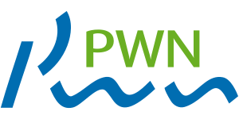
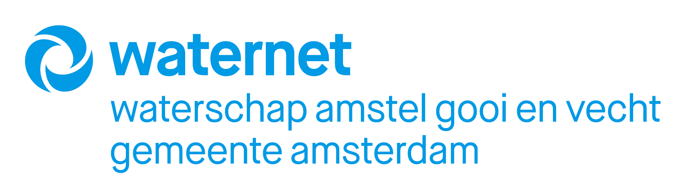
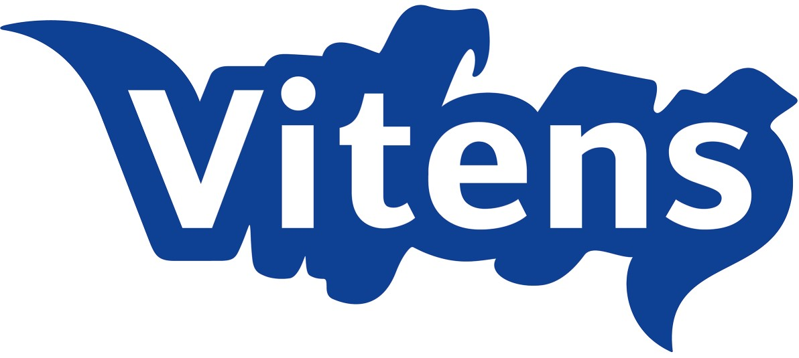
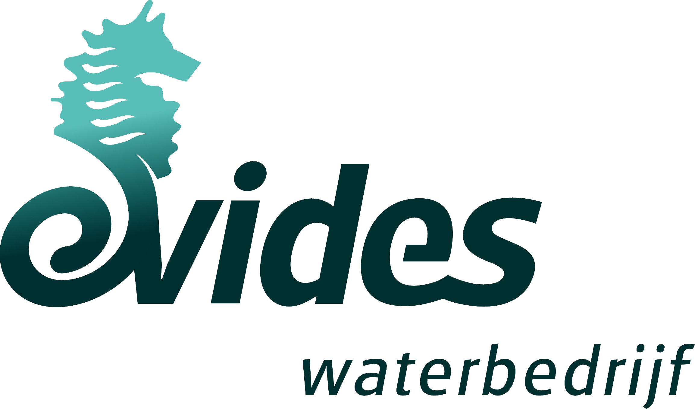

nlmod
=====

.. image:: _static/logo_10000_2.png
  :width: 400
  :alt: The logo of nlmod

nlmod is a package with functions to pre-process, build and visualize MODFLOW
models. The main focus is on building models in the Netherlands using publicly
available datasets, though lots of functionality could be applied to any 
groundwater model. 

nlmod relies heavily on the wonderful features of 
`xarray <https://docs.xarray.dev>`_ and `geopandas <https://geopandas.org>`_ for
storing and manipulating data and `flopy <https://flopy.readthedocs.io>`_ is used for
building and running groundwater models.

nlmod wordt mede mogelijk gemaakt door:
* PWN
* Hoogheemraadschap Hollands Noorderkwartier
* Waternet
* Vitens
* Evides
* Brabant Water

.. image:: _static/logo_hhnk.svg
  :width: 200
  :alt: The logo of Hoogheemraadschap Hollands Noorderkwartier

Please note that the documentation for nlmod is still a work in progress, so
bear with us if certain aspects are incomplete.

.. toctree::
   :maxdepth: 2
   :caption: Contents:

   Getting started <getting_started>
   Examples <examples>
   API-docs <modules>

Indices and tables
==================

* :ref:`genindex`