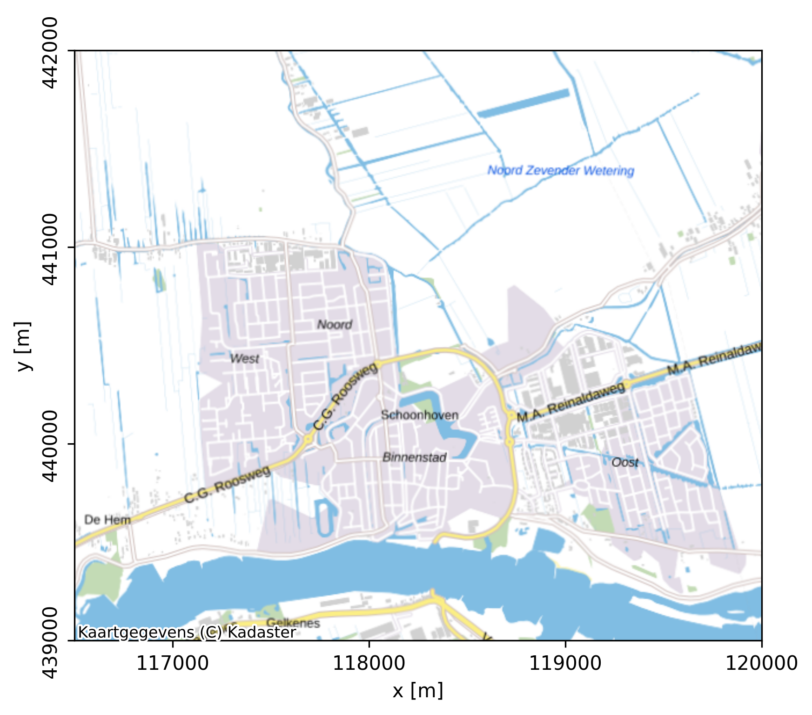
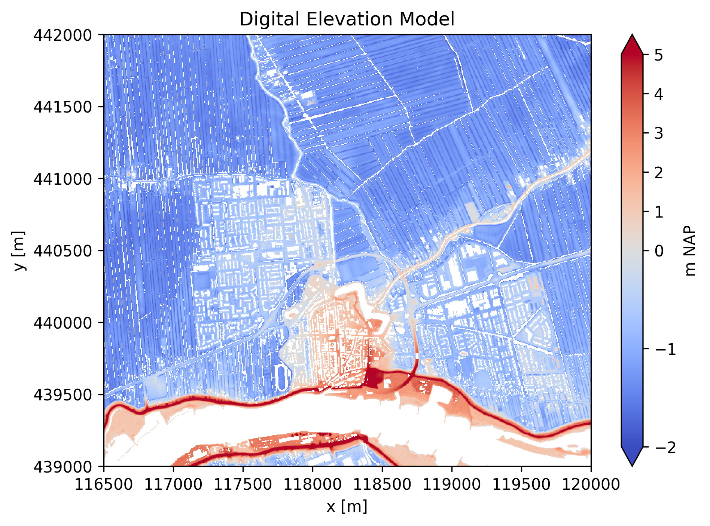
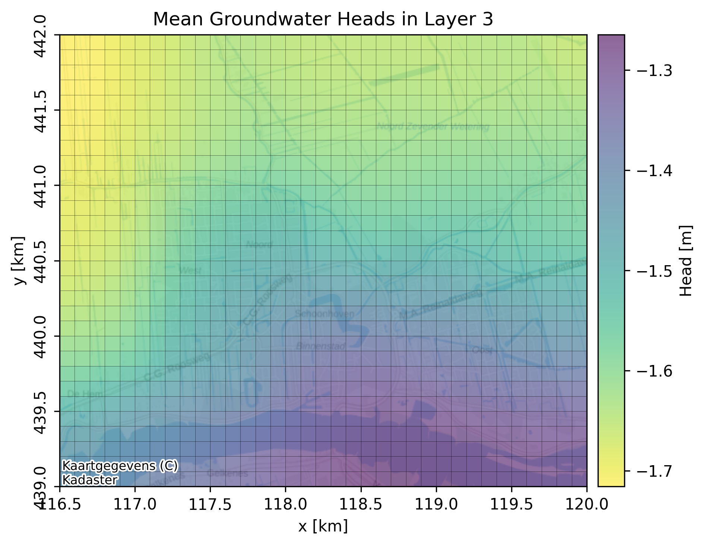

# Summary
`NLMOD` is a Python package to build, run and visualize MODFLOW 6 [@MODFLOW6] groundwater models.
It handles open-data, mainly from the Netherlands, efficiently via the popular Python packages `xarray` [@hoyer_xarray_2017] and `GeoPandas` [@bossche_geopandas_2025].
`FloPy` [@bakker_flopy_2016;@hughes_flopy_2024] is used for creating and running the MODFLOW-based groundwater flow, transport and particle tracking models.

# Statement of need
As groundwater systems face increasing pressure from climate change and overuse, the ability to rapidly develop fit-for-purpose models with the latest open data is essential for decision making and sustainable water management. Building, running and modifying groundwater models is often a time-consuming, error prone task. Finding, cleaning and discretizing the data usually takes the majority of the time leaving less for analyzing, discussing and evaluating model outcomes. As a result, the effects of the modeller's decisions and the model assumptions on outcomes is often unknown. Not surprisingly, a major motivation for modelling decisions is *"experience from colleagues"* [@melsen_village_2022], rather than a thorough assessment of the model performance in relation to the research question.

One of the goals of NLMOD is to reduce development time and minimize errors during data collection and preparation. This allows modellers to focus on evaluating results, estimating parametric uncertainty, and assessing the impact of the model assumptions. In addition, NLMOD provides tools for quick visualization, comparison with measurements, and cross-comparison between models. Meanwhile, scripting these steps, from downloading data to building groundwater models, makes these models more reproducible and transparent.

# Workflow from open data to groundwater model
In general, a NLMOD script to build a groundwater flow model contains four steps:
1. Download relevant data within a defined spatial extent from available online sources, and gather additional data from local sources.
2. Specify spatial and temporal model dimensions, discretize the collected data and store raster data in a single model dataset and vector data in geodataframes.
3. Build and run a groundwater flow model from the model dataset and geodataframes using the flopy package.
4. Post-process model results.

## Downloading open data: `nlmod.read`
The `nlmod.read` module supports downloading relevant geohydrological data from public sources. Raster data is stored in a `xarray.Dataset` [@hoyer_xarray_2017], vector data in a `geopandas.GeoDataFrame` [@bossche_geopandas_2025]. These public data sources can be very broad such as digital terrain models [@AHN], large-scale base maps [@BGT], bathymetry models, geological or geomorphological schematizations [@REGIS;@GEOTOP;@BOFEK;@BRO], meteorological datasets [@KNMI] etc.

At the moment, predominantly open data sources from the Netherlands are supported. However, users can (download and) add any local dataset manually.

## Discretize: `nlmod.dims`
The `nlmod.dims` module allows users to create and adapt both the spatial discretization (e.g., extent, layers, grid) and temporal discretization using an `xarray.Dataset`. Functionality includes data manipulation, such as calculating weighted means and filling not-a-number values, and discritisation methods for both structured and vertex grids. Model data is stored in a single xarray.Dataset (for raster) and a number of geodataframes (for vector data).

## Build and run groundwater models: `nlmod.sim`, `nlmod.gwf`, `nlmod.gwt`, `nlmod.prt`, and `nlmod.modpath`
Using the data in the xarray.Dataset, NLMOD provides tools to build MODFLOW 6 [@MODFLOW6] models via `FloPy` [@bakker_flopy_2016;@hughes_flopy_2024]. The modules `nlmod.sim`, `nlmod.gwf` [@MODFLOW6_GFM], `nlmod.gwt` [MODFLOW6_GTM], and `nlmod.prt` [@MODFLOW6_662] are designed for MODFLOW 6, while `nlmod.modpath` enables particle tracking using MODPATH [@MODPATH7]. This modular approach supports full scriptability which enables complex model optimization schemes.

## Post-process model results: `nlmod.plot` and `nlmod.gis`
To interpret and communicate model inputs and outputs, `NLMOD` offers built-in reading methods(`nlmod.mfoutput`), plotting functionality (`nlmod.plot`) and GIS tools (`nlmod.gis`) for exporting data to commonly used geospatial formats. Other tools allow modellers to easily compare model outcomes with measurements such as groundwater head measurements. These visualization options support both technical analysis and clear communication with stakeholders.

## Example workflow
In the example below a groundwater flow model is build following the nlmod workflow. The model covers a part of 10 km^2 in the Netherlands. The subsurface properties are obtained from a subsurface model (regis), the location of surface water bodies is obtained from an open database (bgt) and the stage derived from a digital elevation model (ahn). A uniform recharge of 0.7 mm/day is assumed.

### Define model properties
```python
# load packages
import nlmod
import flopy as fp
import xarray as xr
from pandas import date_range

nlmod.util.get_color_logger("INFO") # define a logger

extent = [116_500, 120_000, 439_000, 442_000] # model extent (EPSG 28992)

# set name and directories
model_ws = model_name = 'schoonhoven' # model workspace and modelname
figdir, cachedir = nlmod.util.get_model_dirs(model_ws) # figure and cache directories

# plot map
f, ax = nlmod.plot.get_map(extent, background=True, alpha=1.0, figsize=(5,5))
f.savefig(figdir + f'/{model_name}_map.png')
```



### Download relevant data
```python
# download a geohydrological layer model (regis)
regis_ds = nlmod.read.regis.download_regis(extent, cachedir=cachedir, cachename='regis')

# download surface water levels (bgt)
bgt_gdf = nlmod.read.bgt.download_bgt(extent=extent, cachedir=cachedir, cachename='bgt')

# download DEM (ahn)
ahn = nlmod.read.ahn.download_ahn(extent=extent, cachedir=cachedir, cachename='ahn')

# plot the digital elevation model
f, ax = plt.subplots()
ahn.plot(ax=ax, cbar_kwargs={'label':'m NAP'})
ax.set_title('Digital Elevation Model')
f.savefig(figdir+f'/{model_name}_dem.png')
```



### Discretise
```Python
# Discretize
dx, dy = 100., 100. # cellsize

# discretise layer model (regis) to model dimensions
ds = nlmod.to_model_ds(regis_ds, model_name, model_ws, delr=dx, delc=dy)

# add DEM (ahn) to model dataset
ds.update(nlmod.read.ahn.discretize_ahn(ds, ahn))

# specify recharge
ds['recharge'] = xr.ones_like(ds['top']) * 0.0007 # 0.7 mm/day

# add minimum digital elevation to use as surface water stage
bgt_gdf = nlmod.gwf.add_min_ahn_to_gdf(bgt_gdf, ahn, buffer=5.0, column="stage").dropna(subset='stage')
bgt_gdf.plot('stage', legend=True)

# set model time settings
tmin = "2010-01-01"
tmax = "2020-01-01"
freq = "14D"
t = date_range(tmin, tmax, freq=freq)
ds = nlmod.time.set_ds_time(ds, start=3652, time=t, steady_start=True)
```

### Build Groundwater flow model
```Python
# build the modflow6 gwf model
gwf = nlmod.gwf.ds_to_gwf(ds)

# discretize surface water data
sfw_grid = nlmod.grid.gdf_to_grid(
    bgt_gdf, gwf, cachedir=ds.cachedir, cachename="sfw_grid.pklz"
)

# add bed resistance to calculate conductance
bed_resistance = 10.0  # days
sfw_grid["cond"] = sfw_grid.area / bed_resistance
sfw_grid.set_index("cellid", inplace=True)

# build stress period data for RIV package
drn_spd = nlmod.gwf.surface_water.build_spd(sfw_grid, "DRN", ds)

# flopy is used to construct the DRN package directly
drn = fp.mf6.ModflowGwfdrn(gwf, stress_period_data=drn_spd)

# build and run model
nlmod.sim.write_and_run(gwf, ds, silent=True)
```

### Visualise model results
```Python

# load the computed heads
head = nlmod.gwf.output.get_heads_da(ds)

# plot on map
ax = nlmod.plot.map_array(
    head.sel(layer="PZWAz3").mean(dim="time"),
    ds,
    alpha=0.25,
    background=True,
    colorbar_label='m NAP',
    figsize=(8,8),
    title='mean groundwater heads'
)
ax.get_figure().savefig(figdir + f'/{model_name}_heads.png')
```




# Note of thanks
We thank the following institutions and contributors for their support to the development of `NLMOD`:
- [PWN](https://www.pwn.nl/)
- [HHNK](https://www.hhnk.nl/)
- [Waternet](https://www.waternet.nl/)
- [Vitens](https://www.vitens.nl/)
- [Evides](https://www.evides.nl/)

# References
